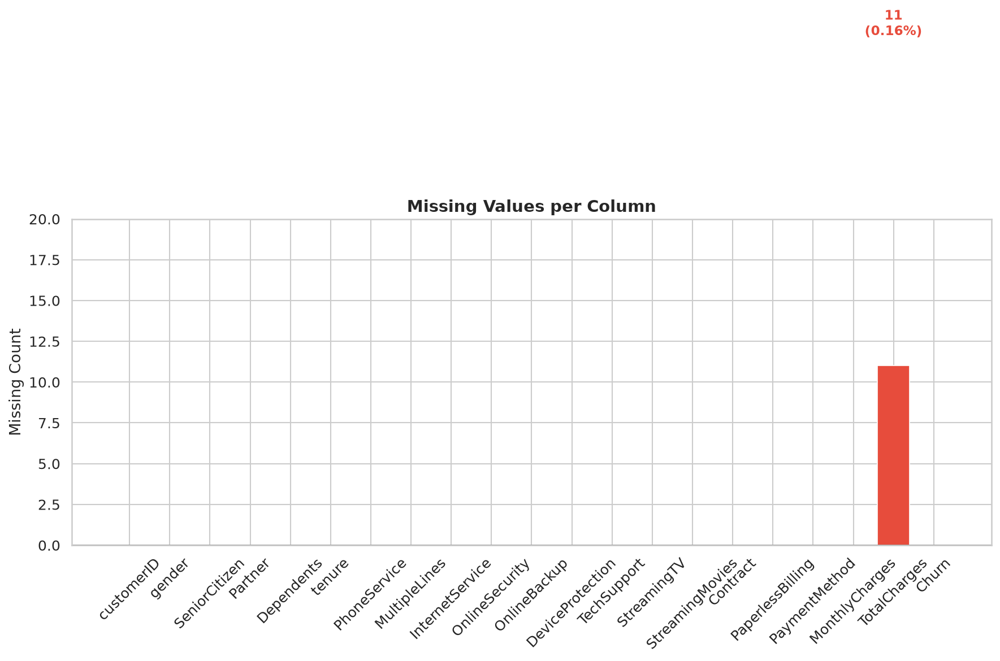
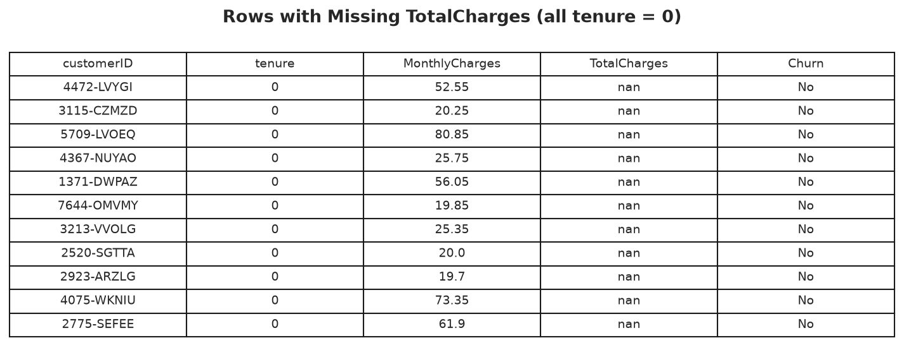
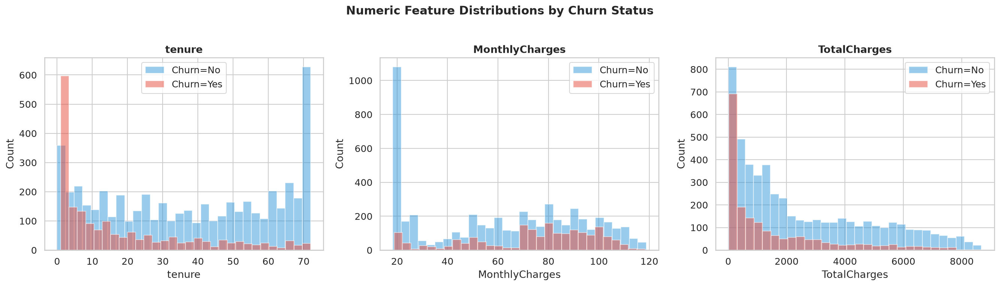
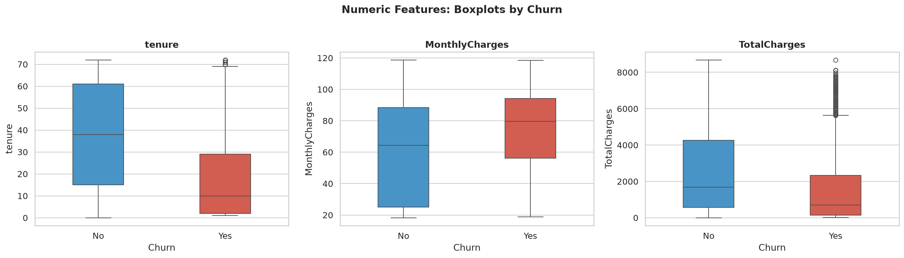
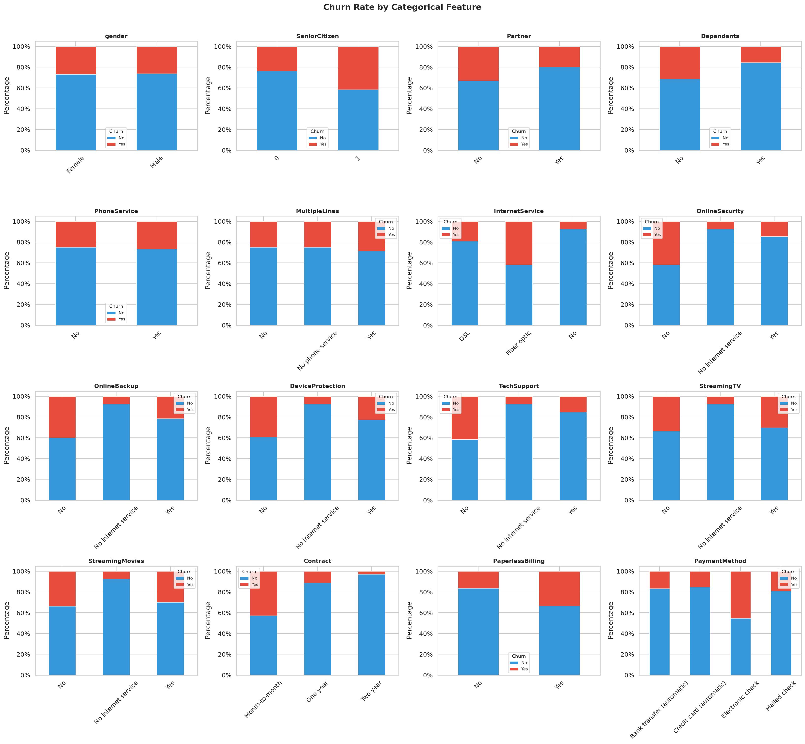
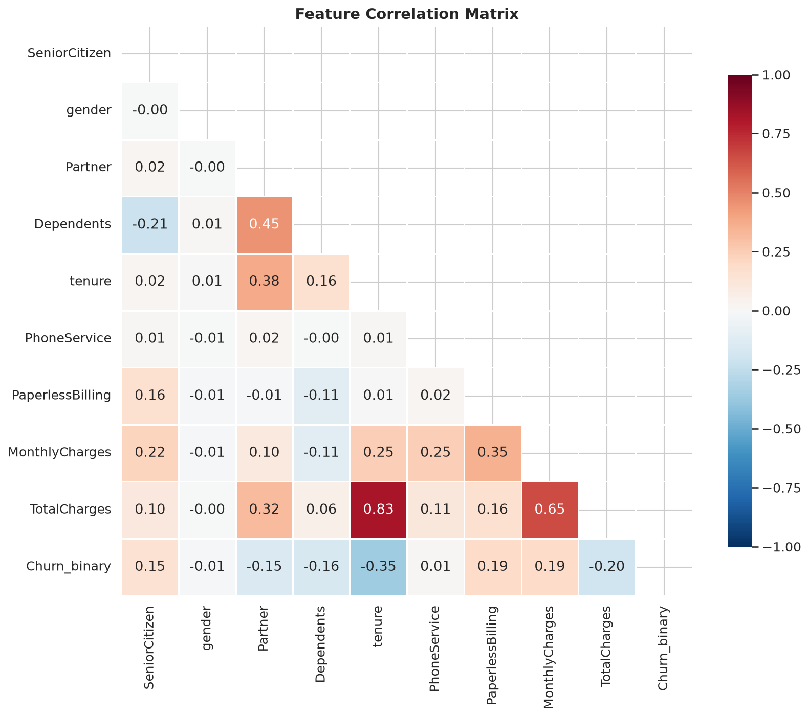
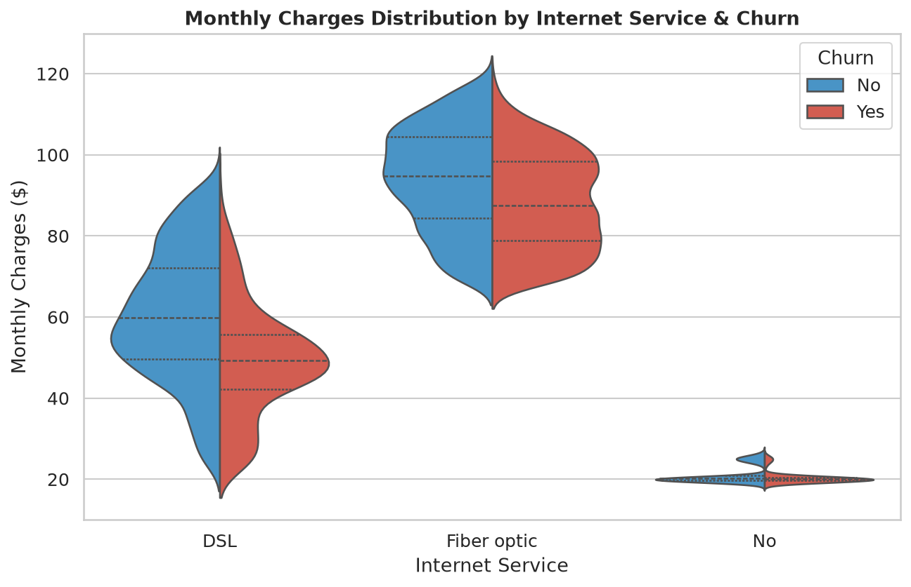

# Exploratory Data Analysis — Observations & Findings

## Dataset Overview

- **7,043 customers** × **21 columns** (1 ID, 3 numeric, 16 categorical, 1 target)
- No traditional null values, but `TotalCharges` is stored as a string in the raw CSV
  and contains 11 whitespace entries — all corresponding to `tenure = 0` customers (new signups).
- **Imputation**: these 11 entries are filled with `0.0`, since no charges have accrued.

---

## Class Imbalance

| Class         | Count | Percentage |
|---------------|------:|-----------:|
| No (stayed)   | 5,174 |      73.5% |
| Yes (churned) | 1,869 |      26.5% |

The imbalance ratio is **2.77 : 1**. A naive model predicting "No" for every customer
would score ~73.5% accuracy while identifying zero actual churners. This is why we use
`class_weight='balanced'` (Logistic Regression) and `scale_pos_weight` (XGBoost) to
up-weight the minority class during training, and evaluate using ROC-AUC, PR-AUC, and
F1-Score rather than accuracy alone.

---

## Numeric Features

**Summary statistics:**

| Statistic | tenure | MonthlyCharges | TotalCharges |
|-----------|-------:|---------------:|-------------:|
| Mean      |  32.37 |          64.76 |      2,279.73 |
| Std       |  24.56 |          30.09 |      2,266.79 |
| Min       |   0.00 |          18.25 |          0.00 |
| Median    |  29.00 |          70.35 |      1,394.55 |
| Max       |  72.00 |         118.75 |      8,684.80 |

**Key findings:**
- **Tenure**: churners cluster heavily at 0–10 months. Long-tenure customers rarely leave.
- **MonthlyCharges**: churners tend to have higher monthly bills.
- **TotalCharges**: churners have lower totals — consistent with leaving early before charges accumulate.

---

## Categorical Features

**Notable patterns:**
- **Gender** has virtually zero predictive power for churn.
- **Senior citizens** churn at nearly double the rate of non-seniors.
- **Contract type** is the single strongest categorical signal:
  - Month-to-month: ~43% churn
  - One-year: ~11% churn
  - Two-year: ~3% churn
- **Fiber optic internet** users churn at ~42%, far above DSL (~19%) and no-internet (~7%).
- Customers **without add-on services** (OnlineSecurity, TechSupport, DeviceProtection) churn
  at higher rates — these services act as retention anchors.
- **Electronic check** payment is associated with the highest churn rate among payment methods.
- **Paperless billing** customers churn more than those receiving paper bills.

---

## Correlation Analysis

**Correlation with Churn (binary):**

| Feature          | Correlation | Direction |
|------------------|:-----------:|:---------:|
| tenure           |   −0.352    |     ↓     |
| TotalCharges     |   −0.198    |     ↓     |
| Dependents       |   −0.164    |     ↓     |
| Partner          |   −0.150    |     ↓     |
| MonthlyCharges   |   +0.193    |     ↑     |
| PaperlessBilling |   +0.192    |     ↑     |
| SeniorCitizen    |   +0.151    |     ↑     |

- **Tenure** has the strongest negative correlation: longer customer relationships → less churn.
- **MonthlyCharges** is positively correlated: higher bills → more churn.
- **TotalCharges** and **tenure** are highly correlated with each other (+0.83), as expected.

---

## Contract × Tenure Interaction

- New customers (0–6 months) churn at **~47%** — roughly 8× the rate of customers with 49–72 months tenure (~6%).
- Month-to-month contracts dominate early churn. Once a customer survives past 12 months, churn drops substantially.
- Two-year contracts show near-zero churn regardless of tenure.

---

## Monthly Charges by Internet Service

- Fiber optic users pay significantly more ($60–100) and churn at higher rates.
- DSL users cluster around $30–60 with moderate churn.
- "No internet" customers have the lowest charges and lowest churn — minimal engagement, but also minimal flight risk.
