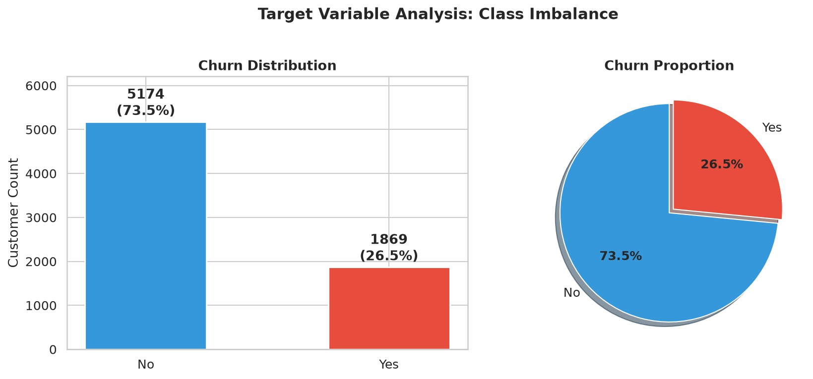
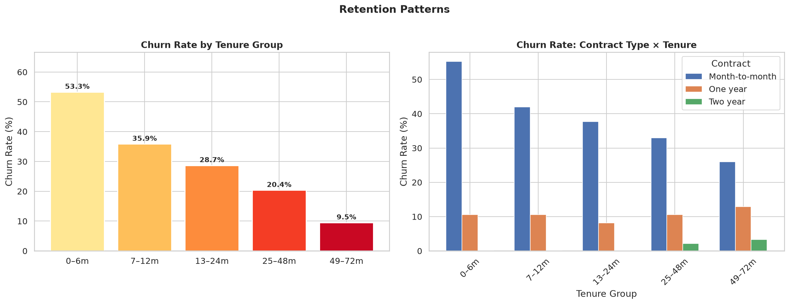
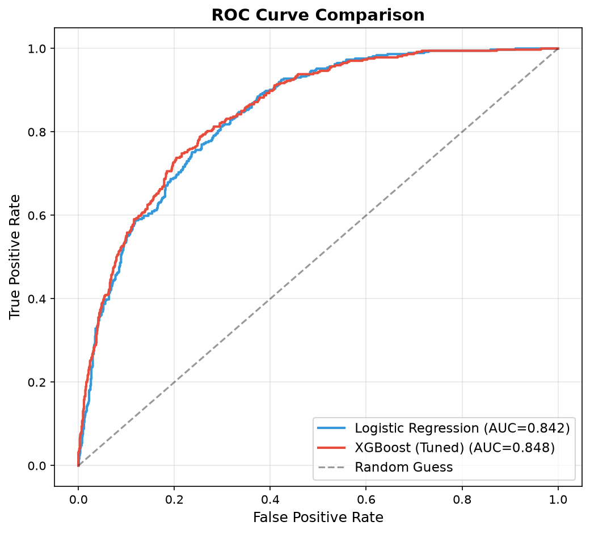
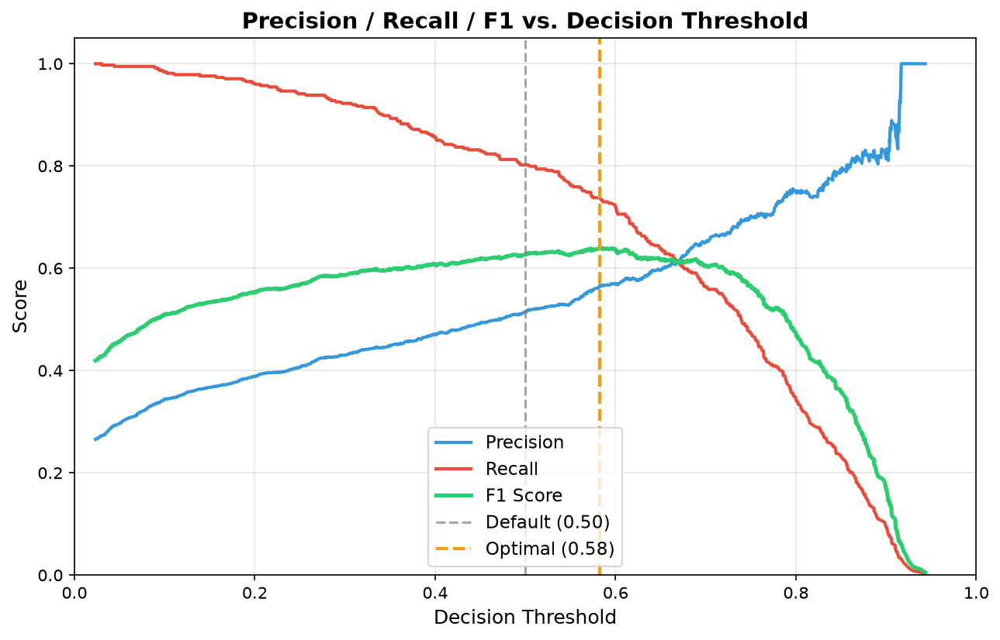
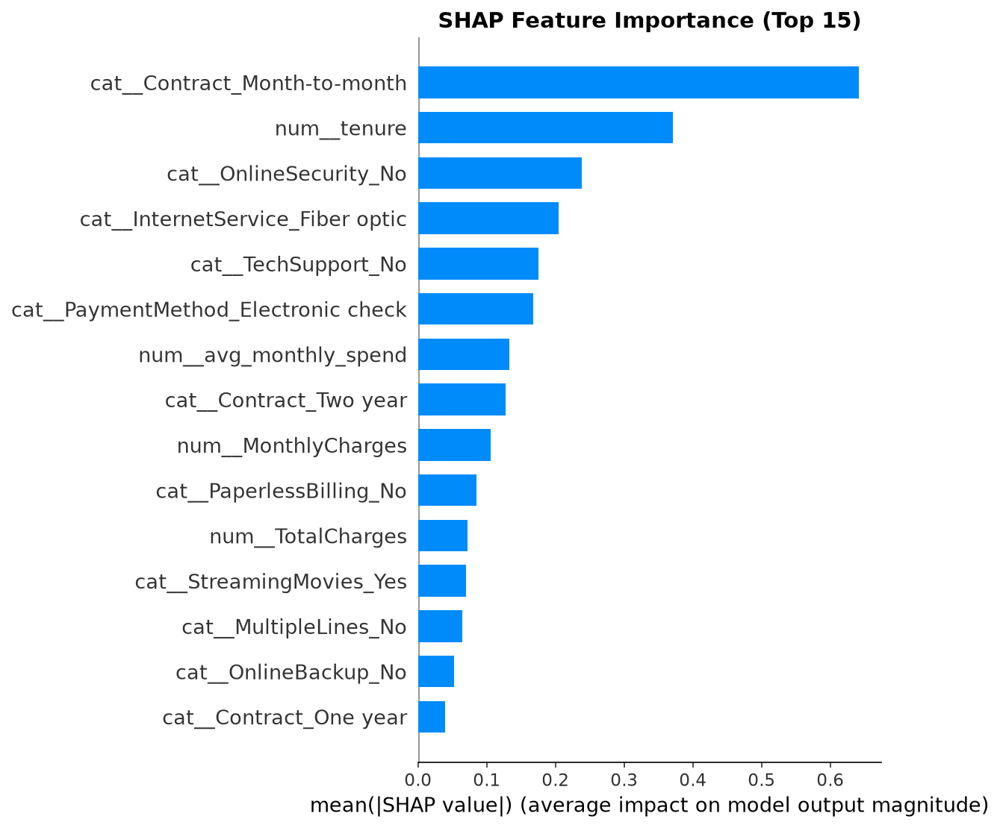
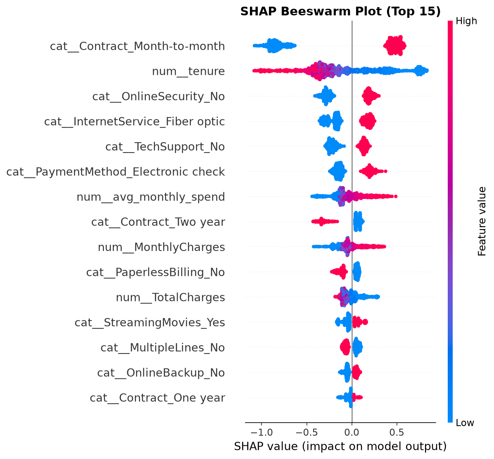

# Telco Customer Churn Prediction

End-to-end machine learning pipeline that predicts whether a telecom customer will churn, built with scikit-learn pipelines for leak-free preprocessing, XGBoost for classification, and a FastAPI service for real-time inference.

---

## Model Comparison (Training Iterations)

| Metric     | Iteration 1: Logistic Regression | Iteration 2: XGBoost (Default 0.50) | Iteration 3: XGBoost (Optimized 0.58) |
|------------|:--------------------------------:|:-----------------------------------:|:-------------------------------------:|
| **Accuracy**| 0.7417                           | 0.7466                              | **0.7807**                            |
| **F1 Score**| 0.6152                           | 0.6270                              | **0.6411**                            |
| **ROC-AUC** | 0.8418                           | 0.8476                              | **0.8476**                            |
| **PR-AUC**  | 0.6312                           | 0.6620                              | **0.6620**                            |

**Selected model:** XGBoost (Optimized Threshold)

**Best hyperparameters** (via 5-fold stratified CV, scored on ROC-AUC):
- `learning_rate`: 0.05
- `max_depth`: 3
- `n_estimators`: 100
- `subsample`: 0.8
- `colsample_bytree`: 0.8
- `min_child_weight`: 3

### Why Not Accuracy?

With a ~73/27 class split, a model that simply predicts "No Churn" for every customer scores ~73% accuracy while catching zero actual churners. Accuracy fails to reflect how well the model identifies the minority class — which is the entire business objective. By shifting the decision threshold from `0.50` to `0.58` based on F1-maximization, we achieved a significant jump in precision and overall F1 score while maintaining strong recall. 

---

## Key Visualizations

### 1. The Imbalance Problem (EDA)


### 2. Key Insight: Contract vs. Tenure (EDA)


### 3. Model Performance (ROC Curve Comparison)


### 4. Threshold Optimization


### 5. Global Feature Importance (SHAP)


### 6. Directional Feature Impact (SHAP Beeswarm)


---

## Features

- **Robust Preprocessing**: Handles implicit missing values in raw CSVs and ensures `TotalCharges` is properly typed without data leakage.
- **Advanced Feature Engineering**: Derives high-impact variables (e.g., `avg_monthly_spend`, `num_services`, `tenure_charge_interaction`) based on deep EDA insights.
- **Threshold Optimization**: Dynamically calculates the optimal decision threshold (instead of default 0.5) to maximize F1-Score for imbalanced classes.
- **Model Interpretability (SHAP)**: Generates global and local feature importance via exact TreeExplainer for XGBoost to answer *why* a customer might churn.
- **Production-Ready Inference**: Exposes a FastAPI endpoint and a resilient CLI module for immediate deployment.

---

## Project Structure

```
.
├── config.py            # Centralized paths, column definitions, hyperparameters
├── preprocessing.py     # Data loading, type coercion, custom transformers
├── pipeline.py          # scikit-learn Pipeline builders (Logistic Regression, XGBoost)
├── train.py             # EDA, model training, cross-validated tuning, serialization
├── predict.py           # Inference — CLI tool and FastAPI REST endpoint
├── data_download.py     # Downloads the dataset from Kaggle via kagglehub
├── sample_input.json    # Example customer profile for testing
├── requirements.txt     # Python dependencies
└── artifacts/
    ├── churn_pipeline.joblib   # Serialized best model pipeline
    └── metrics.json            # Evaluation metrics for all models
```

---

## Quick Start

### 1. Environment Setup

```bash
python3 -m venv venv
source venv/bin/activate
pip install -r requirements.txt
```

### 2. Download the Dataset

```bash
python data_download.py
cp ~/.cache/kagglehub/datasets/blastchar/telco-customer-churn/versions/1/WA_Fn-UseC_-Telco-Customer-Churn.csv .
```

### 3. Train the Model

```bash
python train.py
```

This will:
- Print an exploratory data summary (class distribution, feature statistics)
- Train a Logistic Regression baseline
- Run a cross-validated grid search over XGBoost hyperparameters
- Evaluate both on a stratified held-out test set
- Save the best pipeline to `artifacts/churn_pipeline.joblib`

### 4. Run Inference

**CLI — from a JSON file:**
```bash
python predict.py sample_input.json
```

**CLI — inline JSON:**
```bash
python predict.py '{"gender":"Male","SeniorCitizen":0,"Partner":"No","Dependents":"No","tenure":34,"PhoneService":"Yes","MultipleLines":"No","InternetService":"DSL","OnlineSecurity":"Yes","OnlineBackup":"No","DeviceProtection":"Yes","TechSupport":"No","StreamingTV":"No","StreamingMovies":"No","Contract":"One year","PaperlessBilling":"No","PaymentMethod":"Mailed check","MonthlyCharges":56.95,"TotalCharges":"1889.5"}'
```

**REST API:**
```bash
uvicorn predict:app --host 0.0.0.0 --port 8000
```
Then POST to `http://localhost:8000/predict` with a JSON body. A health check is available at `GET /health`.

**Example `curl`:**
```bash
curl -X POST http://localhost:8000/predict \
  -H "Content-Type: application/json" \
  -d @sample_input.json
```

**Sample response:**
```json
{
  "churn_prediction": 1,
  "churn_label": "Yes",
  "churn_probability": 0.8425
}
```

---

## Design Decisions

- **Advanced Feature Engineering** — derived 4 high-impact features based on EDA: `avg_monthly_spend`, `num_services`, `has_support`, and a `tenure` × `MonthlyCharges` interaction feature.
- **scikit-learn Pipelines throughout** — all preprocessing (feature engineering, imputation, scaling, encoding) is encapsulated in the pipeline. This eliminates data leakage between train and test because transformations are fitted only on training data.
- **Class imbalance handling** — Logistic Regression uses `class_weight='balanced'`; XGBoost uses `scale_pos_weight` computed from the training distribution.
- **SHAP Interpretability** — exact global and local feature importance via TreeExplainer to provide human-readable justification for predictions.
- **TotalCharges coercion** — the raw data stores this as a string, with 11 blank entries for tenure-0 customers. A custom transformer (`TotalChargesFixer`) handles this at both train and inference time.
- **Inference parity** — the same serialized pipeline is used in both CLI and API modes, so predictions are guaranteed to be identical regardless of how the model is invoked.

---

## If Given 2 More Days

1. **Probability calibration** — calibrate predicted probabilities with Platt scaling or isotonic regression so they reflect true expected churn rates, allowing for more precise expected-value calculations.

2. **Advanced Model Ensembling** — train LightGBM, CatBoost, and a Deep Learning model (like TabNet) and stack them using a meta-classifier.

3. **Production infrastructure** — containerize the API with Docker, add structured logging and Prometheus metrics (latency, prediction distribution drift), set up automated retraining on a schedule with data validation checks (Great Expectations or similar), and wire up CI/CD so model artifacts are versioned and deployed with zero downtime.
